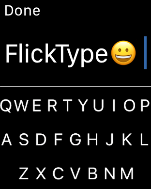

# General

You may only use the FlickType SDK with the express permission of KPAW, LLC.

The SDK is owned by KPAW, LLC and licensed, not sold, to you. The SDK, content, visual interfaces, interactive features, information, graphics, design, compilation, computer code, products, services, and all other elements of the SDK and related documentation (the "FlickType Materials"), are protected by copyright, trade dress, patent, and trademark laws of the United States and other jurisdictions, international conventions, and all other relevant intellectual property and proprietary rights, and applicable laws. As between you and KPAW LLC, all FlickType Materials, including intellectual property rights therein and thereto, are the sole and exclusive property of KPAW, LLC.

You may not decompile, reverse engineer, or otherwise access or attempt to access the source code for the SDK not made available to you in source code form, or make or attempt to make any modification to the SDK; or remove, obscure, interfere with or circumvent any feature of the SDK, including without limitation any copyright or other intellectual property notices, security, or access control mechanism. You may not use the SDK for any purpose other than interoperating with the Service in a manner for which the SDK and Service are expressly designed. 

# Attribution

If your App includes the SDK, your Apple Watch marketing material on the App Store **must** include the following unaltered screenshot:

### Series 4 size

### Series 3 size

Terms subject to change.
