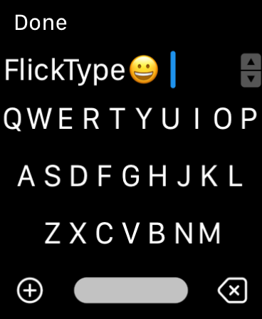

[](https://travis-ci.com/keleftheriou/FlickTypeKit) 

# FlickTypeKit 🚀

["Apple Watch App of the Year"](https://appadvice.com/post/appadvices-top-10-apple-watch-apps-2018/764638) - AppAdvice

["Makes Typing a Breeze"](https://www.forbes.com/sites/davidphelan/2019/03/02/apple-watch-flicktype-gesture-keyboard-app-makes-typing-a-breeze-is-it-any-good/) - Forbes



Join the developer discussion on our [Discord server](https://discord.gg/r6s5kW8). Terms & conditions of our free SDK in the [license](LICENSE.md).

## Integration ⚙️
- Copy the `FlickTypeKit` directory from `FlickTypeKit Sample (Swift)` into your project root folder.

_**Note**: Do not drag it into Xcode._
### In your watch extension target: 
  - Under **General** > **Embedded Binaries**, add `FlickTypeKit.framework` by selecting the **+** button and then `Add Other...`
  - Under **Build Phases**, add a "New Run Script Phase" and place it before the "Compile Sources" phase. Set the contents of the script to the following, to automatically switch between the `watchos` and `watchsimulator` variants of the framework as needed:
```
set -eu
"${PROJECT_DIR}/FlickTypeKit/_internal/select-framework.sh" "${PLATFORM_NAME}"
```
### In you watch app target:
  - Under **Build Phases** > **Copy Bundle Resources**, add the `App Resources/FlickType.storyboard` and `App Resources/keyboard.png` files.
  - Add a "Storyboard Reference" to your main watch storyboard file and set its "Referenced ID" to `FlickType`.

That's it!

## Usage
Simply `import FlickType` and then modify your existing `presentTextInputController()` calls to include the additional `flickTypeMode` argument:

```
import FlickTypeKit

presentTextInputController(withSuggestions: nil, allowedInputMode: .allowEmoji, flickTypeMode: .ask) { items in
  if let text = items?.first as? String {
    print("User typed text: \(text)")
  }
}
```

_**Note**: `FlickTypeKit.framework` is initially an empty placeholder, and Xcode might highlight the `import FlickTypeKit` line with an error; simply building your project will populate the framework and fix this._

### Configuration
 - `FlickType.Mode.ask` will offer a choice between FlickType and the standard input methods _(recommended)_.
 - `FlickType.Mode.always` will _only_ offer FlickType, skipping the input method selection.
 - `FlickType.Mode.off` will _only_ offer the standard input methods.

### Editing
The optional `startingText` argument can be used to support editing of existing text. Editing is currently only supported with FlickType; the value of `startingText` is ignored when using one of the standard input methods.

### Running on device
Once you get things working in the Simulator, email us at [sdk@flicktype.com](mailto:sdk@flicktype.com) to whitelist your app and have FlickType work on real devices.

See the included sample app, and let us know if you have any questions or issues!

## Coming soon
- Improved number & symbol entry
- More languages
- Much more…

# ⌚️😎
