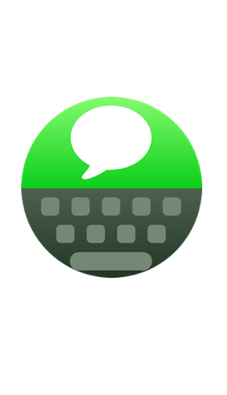

# FlickTypeKit 🚀
[](https://travis-ci.com/FlickType/FlickTypeKit) 

[_“Apple Watch App of the Year”_](https://appadvice.com/post/appadvices-top-10-apple-watch-apps-2018/764638) - AppAdvice
<br>
[_“Makes Typing a Breeze”_](https://www.forbes.com/sites/davidphelan/2019/03/02/apple-watch-flicktype-gesture-keyboard-app-makes-typing-a-breeze-is-it-any-good/) - Forbes

Add a powerful keyboard to your watchOS apps and dramatically improve the text input experience for users. Leverage full typing and editing capabilities to greatly enhance existing parts of your app, or enable entirely new features like messaging and note-taking directly on Apple Watch.

### SwiftUI
Use `FlickTypeView` to display an editable text interface to gather text input from the user:

<pre>
<b>import FlickTypeKit</b>

struct ContentView: View {
  var body: some View {
    ScrollView {
      VStack {
        // other views here...
        <b>FlickTypeView(title: "Message")</b>
        // more views here...
      }
    }
  }
}
</pre>

### WatchKit
Modify your `presentTextInputController()` calls to include the `flickTypeMode` argument:

<pre>
<b>import FlickTypeKit</b>

presentTextInputController(
  withSuggestions: nil,
  allowedInputMode: .allowEmoji,
  <b>flickTypeMode: .ask</b>) { items in
  if let text = items?.first as? String {
    print("User typed text: \(text)")
  }
}
</pre>

 `.ask` will offer a choice between FlickType and the standard input methods _(recommended)_.
 <br>
 `.always` will always open FlickType, skipping the input method selection.
 <br>
 `.off` will present the standard input method selection without the FlickType option.

_**Note:** When using WatchKit, the optional `startingText` argument can be used to support editing of existing text with FlickType. In SwiftUI, `FlickTypeView` does that automatically for you._

## Integration

### In your watch extension target: 
  - Under **General** > **Frameworks, Libraries, and Embedded Content**, click the **+** button, `Add Other...` and add the `FlickTypeKit.xcframework` bundle.

### In you watch app target:
  1. Under **Build Phases** > **Copy Bundle Resources**, add the `FlickType.storyboard` file.
  2. Add a "Storyboard Reference" to your main storyboard file and set its "Referenced ID" to `FlickType`.

### watchOS 7 and later
Starting with watchOS 7, FlickTypeKit uses [universal links](https://developer.apple.com/documentation/xcode/allowing_apps_and_websites_to_link_to_your_content) to switch from your app to the [FlickType Keyboard](https://apps.apple.com/us/app/flicktype-keyboard/id1359485719) app and return the result back to your app. Thus the keyboard stays up-to-date without you having to update your app, and leverages the user's custom settings and dictionary. To support universal links in your app: 

1. Add an associated domain entitlement to your watch extension target:


2. Host a `https://your.app.domain/.well-known/apple-app-site-association` file with the following contents:
```{
  "applinks": {
      "details": [
           {
             "appIDs": [ "<Team ID>.your.watchkitextension.identifier" ],
             "components": [
               {
                  "/": "/flicktype/*",
                  "comment": "Matches any URL whose path starts with /flicktype/"
               }
             ]
           }
       ]
   }
}
```

3. Add the following inside your `WKExtensionDelegate.applicationDidFinishLaunching()`:
```
FlickType.returnURL = URL(string: "https://your.app.domain/flicktype/")
```
4. Add the following inside your `WKExtensionDelegate.handle(_ userActivity: NSUserActivity)`:
```
if FlickType.handle(userActivity) { return }
```

### watchOS 6 and earlier
Once you get things working in the Simulator, email [sdk@flicktype.com](mailto:sdk@flicktype.com) with the bundle ID of your watch _extension_ target to get whitelisted for use on real devices.

### Help & support
 - The sample app contains implementations for both SwiftUI & WatchKit. 
 - Additional [technical notes & FAQ](docs/Notes.md).
 - Join our [Discord](https://discord.gg/MFyvmhe)
 - [Email](mailto:sdk@flicktype.com) us!

# ⌚️
