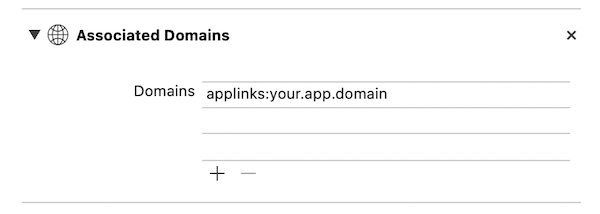

[](https://travis-ci.com/FlickType/FlickTypeKit) 

# FlickTypeKit 🚀

- [_**“Apple Watch App of the Year”**_](https://appadvice.com/post/appadvices-top-10-apple-watch-apps-2018/764638) - AppAdvice
- [_**“Makes Typing a Breeze”**_](https://www.forbes.com/sites/davidphelan/2019/03/02/apple-watch-flicktype-gesture-keyboard-app-makes-typing-a-breeze-is-it-any-good/) - Forbes


## Integration
- Copy the `FlickTypeKit` directory from `FlickTypeKit Sample (Swift)` into your project folder.

### In your watch extension target: 
- Under **General** > **Frameworks, Libraries, and Embedded Content**: click the **+** button, then `Add Other...`/`Add Files...` and add `FlickTypeKit.xcframework`.

### In you watch app target:
  - Under **Build Phases** > **Copy Bundle Resources**, add the `App Resources/FlickType.storyboard` file.
  - Add a "Storyboard Reference" to your main watch storyboard file and set its "Referenced ID" to `FlickType`.

_**Note**: If your app is in Objective-C, make sure [Always Embed Swift Standard Libraries](https://indiestack.com/2017/03/implicit-swift-dependencies/) is set to YES for the watch extension target. You can also watch this [integration tutorial](https://www.youtube.com/watch?v=f7TkCE7gaDc)_

## Usage
Simply `import FlickType` and then modify your existing `presentTextInputController()` calls to include the additional `flickTypeMode` argument:

```
import FlickTypeKit

presentTextInputController(withSuggestions: nil, allowedInputMode: .allowEmoji, flickTypeMode: .ask) { items in
  if let text = items?.first as? String {
    print("User typed text: \(text)")
  }
}
```

### Configuration
 - `FlickType.Mode.ask` will offer a choice between FlickType and the standard input methods _(recommended)_.
 - `FlickType.Mode.always` will _only_ offer FlickType, skipping the input method selection.
 - `FlickType.Mode.off` will _only_ offer the standard input methods.

### Editing
The optional `startingText` argument can be used to support editing of existing text. Editing is currently only supported with FlickType; the value of `startingText` is ignored when using one of the standard input methods.

## watchOS 7
Starting with watchOS 7, FlickTypeKit uses [universal links](https://developer.apple.com/documentation/xcode/allowing_apps_and_websites_to_link_to_your_content) to switch from your app to the main FlickType app on the user's device, and return back to your app when text input is completed. This ensures that the text input experience is always up-to-date without you having to update your app, and will utilize the user's FlickType settings and custom dictionary across all other apps. To support universal links in your app: 


1. Add an associated domain entitlement to your watch extension target:


2. Host a `https://your.app.domain/.well-known/apple-app-site-association` file with the following contents:
```{
  "applinks": {
      "details": [
           {
             "appIDs": [ "<Team ID>.your.watchkitextension.identifier" ],
             "components": [
               {
                  "/": "/flicktype/*",
                  "comment": "Matches any URL whose path starts with /flicktype/"
               }
             ]
           }
       ]
   }
}
```

3. Add the following inside your `WKExtensionDelegate.applicationDidFinishLaunching()`:
```
FlickType.returnURL = URL(string: "https://your.app.domain/flicktype/")
```
4. Add the following inside your `WKExtensionDelegate.handle(_ userActivity: NSUserActivity)`:
```
if FlickType.handle(userActivity) { return }
```

### watchOS 6 and earlier
Once you get things working in the Simulator, email us at [sdk@flicktype.com](mailto:sdk@flicktype.com) with the bundle ID of your watch _extension_ target, so we can whitelist it for use on real devices.

### Help & support
See the included sample app, join us on [Discord](https://discord.gg/MFyvmhe), or [email](mailto:sdk@flicktype.com) us!

# ⌚️
