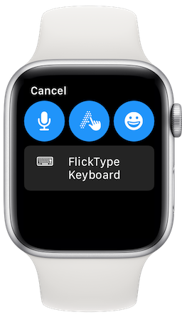

[](https://apps.apple.com/us/app/flicktype-keyboard/id1359485719)
[](https://apps.apple.com/us/app/flicktype-keyboard/id1359485719)
[](https://apps.apple.com/us/app/flicktype-keyboard/id1359485719)

# FlickTypeKit 🚀
[](https://travis-ci.com/FlickType/FlickTypeKit) 

[_“Best of 2020”_](https://apps.apple.com/us/story/id1535572713) - Apple
<br>
[_“Apple Watch App of the Year”_](https://appadvice.com/post/appadvices-top-10-apple-watch-apps-2018/764638) - AppAdvice
<br>
[_“Makes Typing a Breeze”_](https://www.forbes.com/sites/davidphelan/2019/03/02/apple-watch-flicktype-gesture-keyboard-app-makes-typing-a-breeze-is-it-any-good/) - Forbes

Add a powerful keyboard to your watchOS apps and dramatically improve the text input experience for users. Leverage full typing and editing capabilities to greatly enhance existing parts of your app, or enable entirely new features like messaging and note-taking directly on Apple Watch.

### SwiftUI
Use a `FlickTypeTextEditor` to display an editable text interface and gather text input from the user:

<pre>
<b>import FlickTypeKit</b>

struct ContentView: View {
  @State private var text = ""
  var body: some View {
    ScrollView {
      VStack {
        // other views here...
        <b>FlickTypeTextEditor(text: $text)</b>
        // more views here...
      }
    }
  }
}
</pre>

### WatchKit
Modify your `presentTextInputController()` calls to include the `flickType` argument:

<pre>
<b>import FlickTypeKit</b>

presentTextInputController(
  withSuggestions: nil,
  allowedInputMode: .allowEmoji,
  <b>flickType: .ask</b>) { items in
  if let text = items?.first as? String {
    print("User typed text: \(text)")
  }
}
</pre>

 `.ask` will offer a choice between FlickType and the standard input methods _(recommended)_.
 <br>
 `.always` will always open FlickType, skipping the input method selection.
 <br>
 `.off` will present the standard input method selection without the FlickType option.

_**Note:** When using WatchKit, the optional `startingText` argument can be used to support editing of existing text with FlickType. In SwiftUI, `FlickTypeTextEditor` does that automatically for you._

## Integration

### Swift Package Manager

```
https://github.com/FlickType/FlickTypeKit
```
This version of FlickTypeKit will only show FlickType as an input option to users on watchOS 7 or later. FlickTypeKit uses [universal links](https://developer.apple.com/documentation/xcode/allowing_apps_and_websites_to_link_to_your_content) to switch from your app to the [FlickType Keyboard](https://apps.apple.com/us/app/flicktype-keyboard/id1359485719) app, and then return the input text back to you. Thus the keyboard stays up-to-date without you having to update your app, and leverages the user's custom settings and dictionary. To support universal links in your app: 

1. Add an [applinks](https://developer.apple.com/documentation/safariservices/supporting_associated_domains) associated domain entitlement to your watch extension target:


2. Create a file named [`apple-app-site-association`](https://developer.apple.com/documentation/safariservices/supporting_associated_domains) (without an extension) with the following contents, and place it in your site’s `.well-known` directory:

```
{
  "applinks": {
      "details": [
           {
             "appIDs": [ "<Team ID>.your.watchkitextension.identifier" ],
             "components": [
               {
                  "/": "/flicktype/*",
                  "comment": "Matches any URL whose path starts with /flicktype/"
               }
             ]
           }
       ]
   }
}
```

The file’s URL should match the format `https://your.app.domain/.well-known/apple-app-site-association` and must be hosted with a valid certificate and with no redirects.

3. Add the following inside your `WKExtensionDelegate.applicationDidFinishLaunching()`:
```
FlickType.returnURL = URL(string: "https://your.app.domain/flicktype/")
```
4. Add the following inside your `WKExtensionDelegate.handle(_ userActivity: NSUserActivity)`:
```
if FlickType.handle(userActivity) { return }
```

### Help & support
 - The sample app contains implementations for both SwiftUI & WatchKit. 
 - Join our [Discord](https://discord.gg/MFyvmhe)
 - [Email](mailto:sdk@flicktype.com) us!
